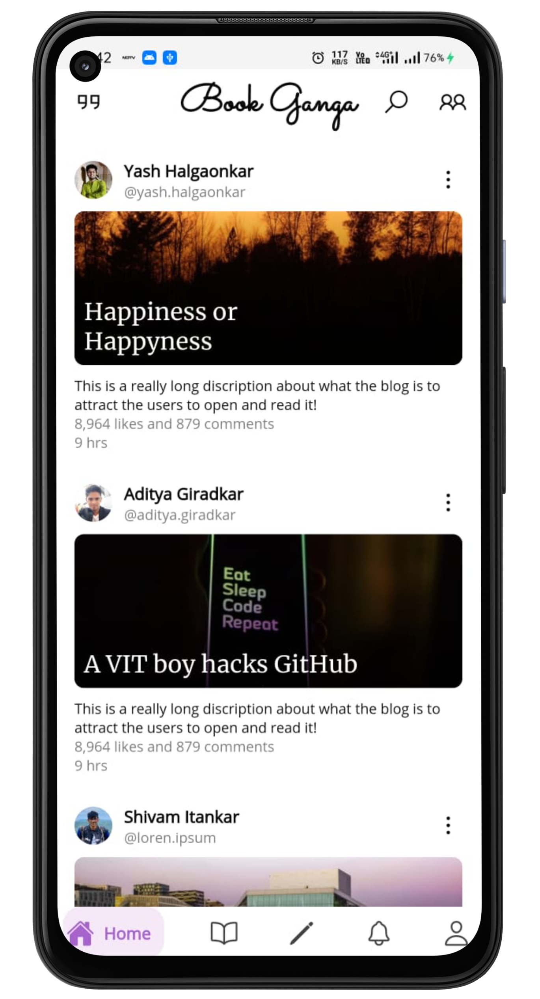
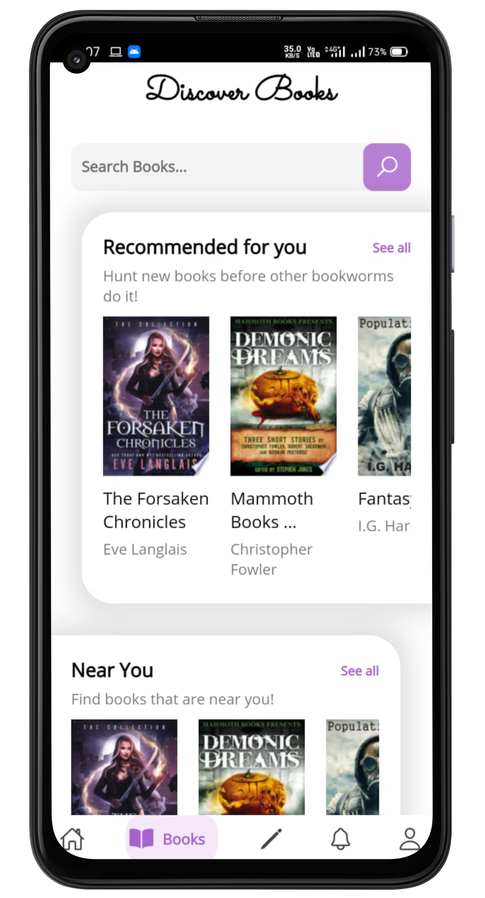
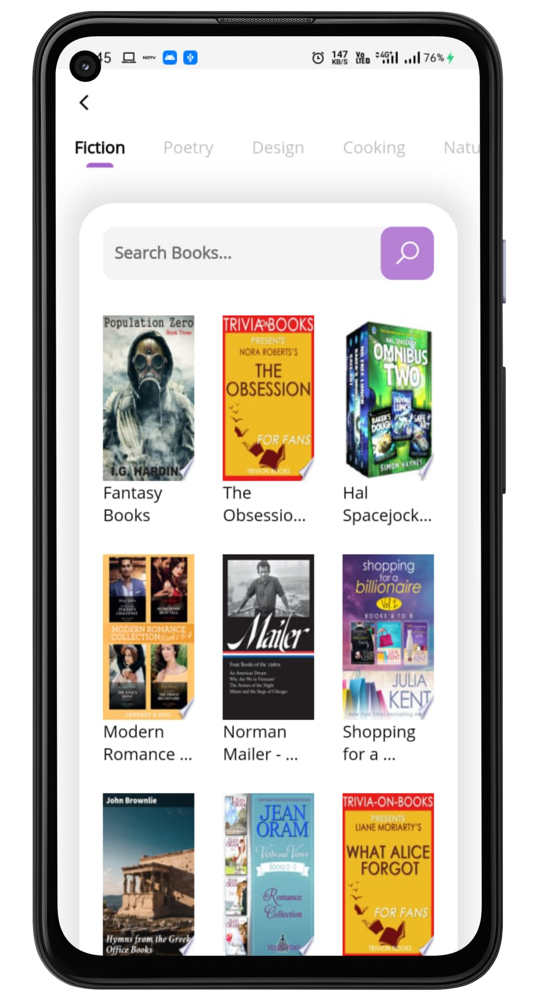
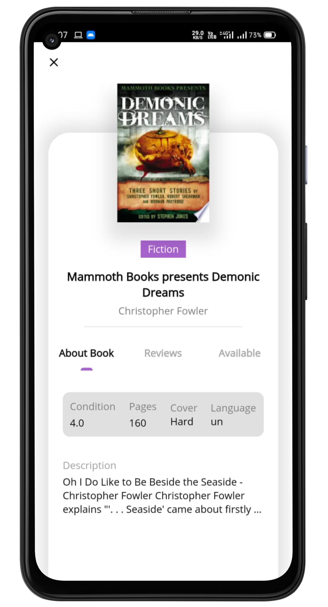
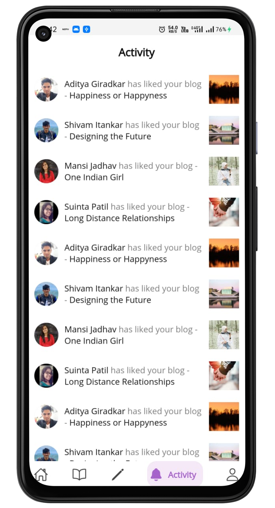
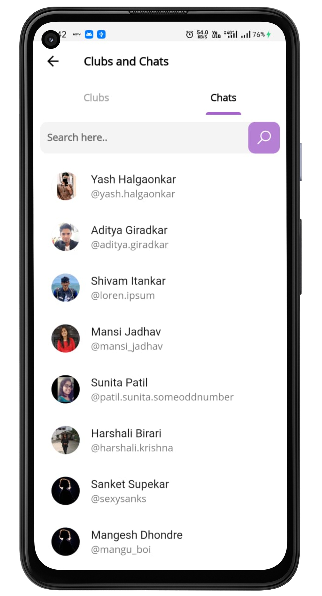
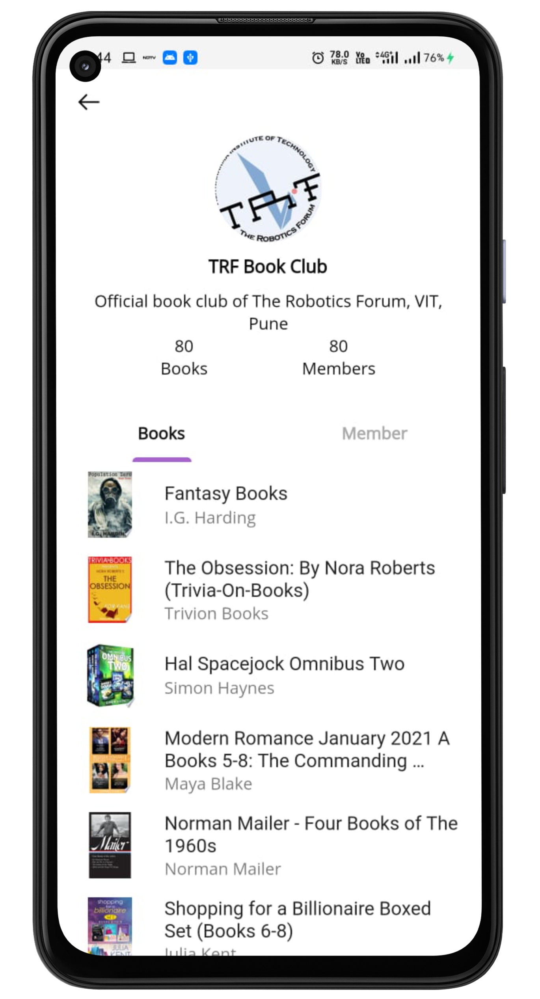

<h1 align="center">
   📚 BookGanga 📚
</h1>
<h2 align="center">
    A platform to share books, thoughts and ideas ✨  
    By the readers... For the readers...
 </h2>
<h3 align="center">
  Built with ❤︎ by
  <a href="https://github.com/yashhalgaonkar">Yash</a>
</h3>

<h3>Description</h3> 

BookGanga is a platform that allows you to borrow and share books with people near you (like Tinder for readers). You can create your book clubs and also chat with other users. You can put your books up for sharing either for free or some nominal charges. Now you can earn money with books in your bookshelf. You can also post blogs and reviews of books you have read. 

This app has been made using Flutter Framework. Backend of the project is private for security reasons.

<h3>Feature</h3>
<ul>
  <li>Find books near you/li>
  <li>Share your books with other and earn moeny</li>
  <li>Follow people and tahs</li>
  <li>Read blogs from people and tags you follow</li>
  <li>Discover new books to read/li>
  <li>Form books clubs and share amazing ideas</li>
  <li>Chat with other user </li>
</ul>

<h3>Screenshots</h3>

  
  
   

  
  
   

  
  

 Do ⭐ the repo if you like it.   Contributions and pull requests are welcomed. 

